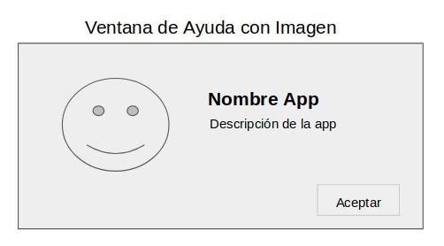

# Ventanas con Java Swing

Crear 3 ventanas con java swing, con las especificaciones que aparecen en las imágenes.

## Imágenes

## Recursos

* http://arodu.xyz/class/resources/guia_java_swing-programacion_2.pdf
* http://dalila.sip.ucm.es/~manuel/JSW1/Slides/Swing.pdf
* https://www.uv.mx/personal/mansuarez/files/2013/08/uso-de-java-swing.pdf
* http://profesores.elo.utfsm.cl/~agv/elo329/1s17/lectures/Java/JavaGraphicsProgramming.pdf
